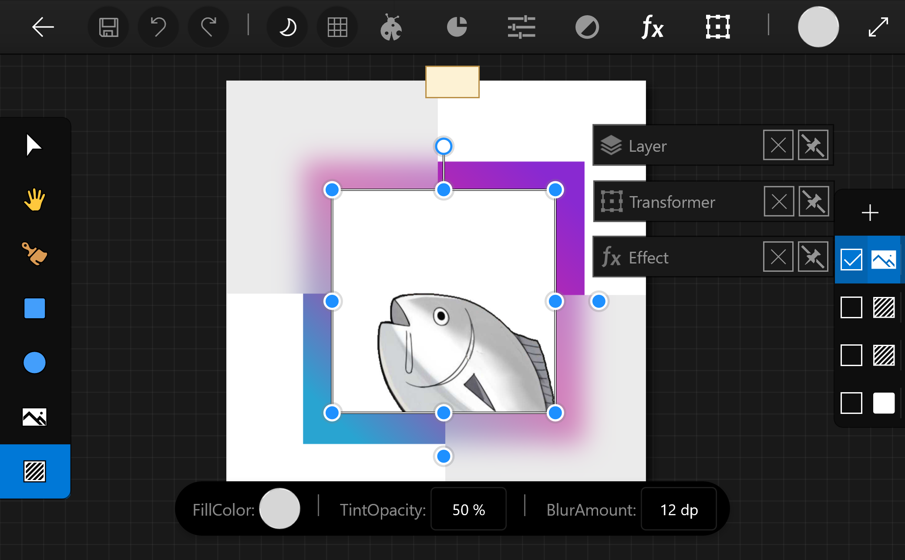
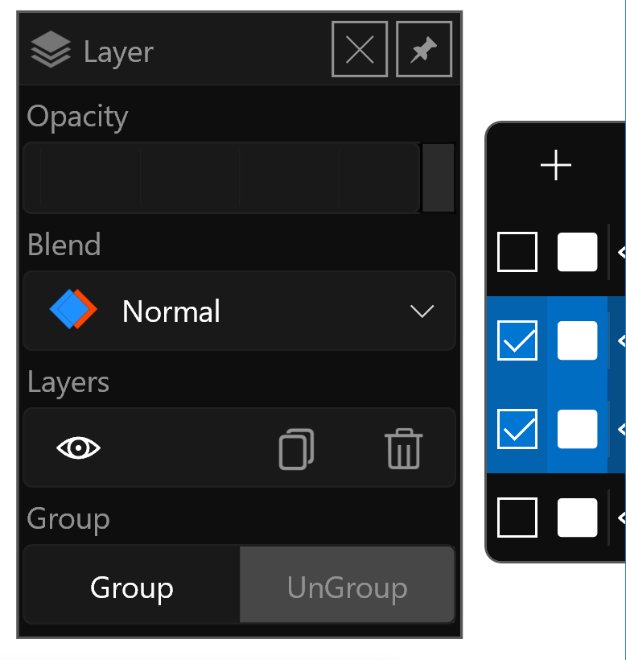
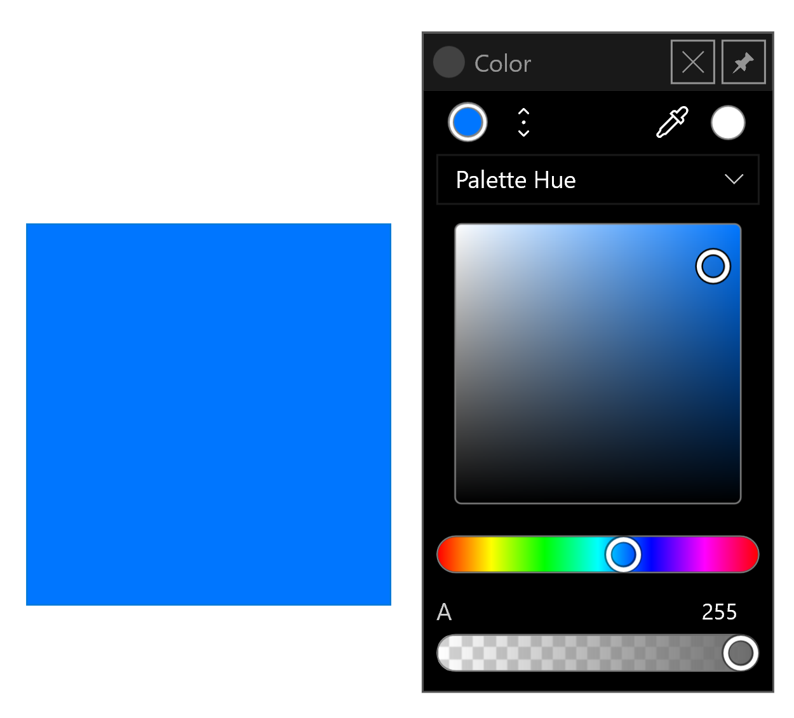
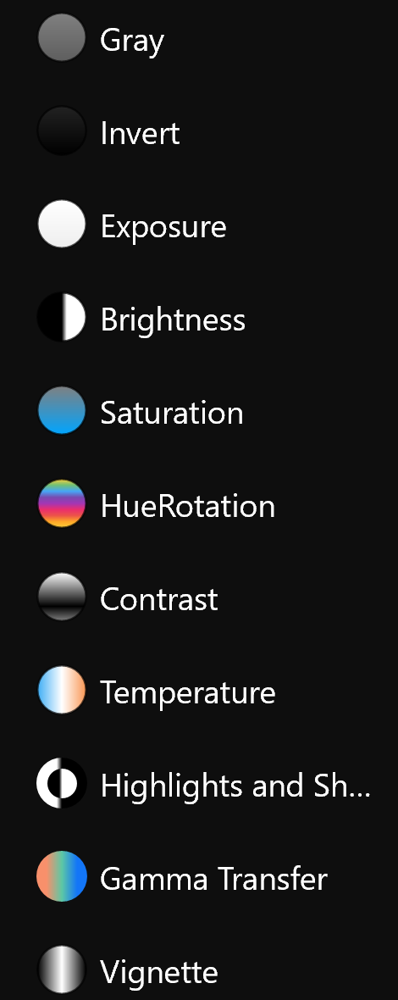
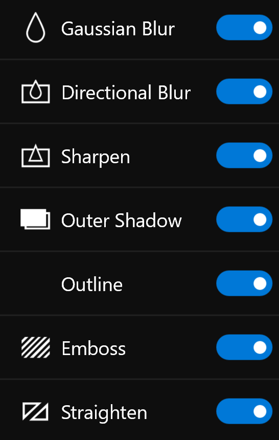
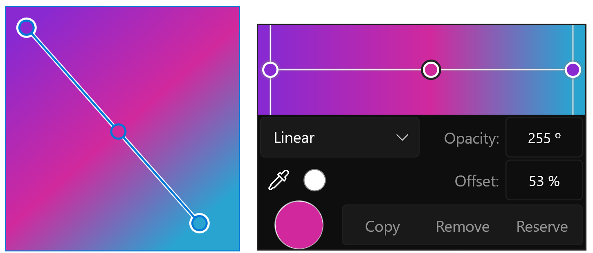
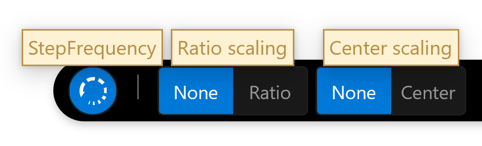
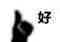
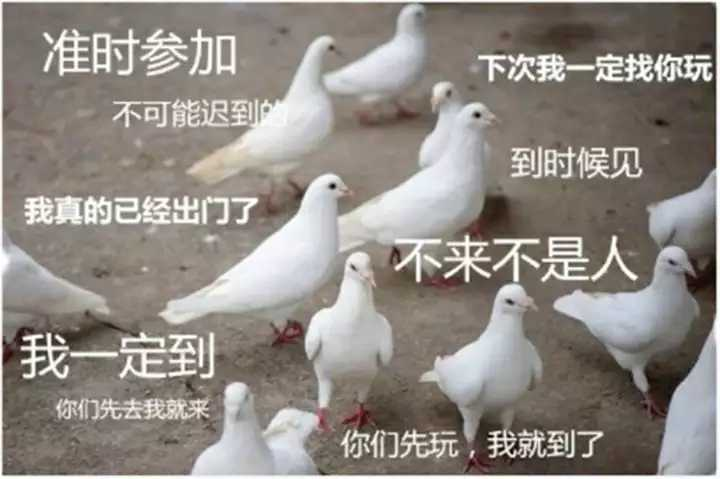

2019.7.12

# 【预告】Retouh Photo2正在开发

# 预告
个人独立设计软件《Retouh Photo2》正在开发，预计2020年1月之前发布。

- 发布平台：Windows10应用商店
- 系统平台：win10 Fall Create Update及更高
- 主要用途：矢量图形
- 使用技术：win2D
- 开源地址：ysdy44/Retouch-Photo-UWP-2(取消开源)
- 作者：我
- 软件截图：

 

---

 

## 支持

1.支持图层多选、可视、混合、透明

2.一般路过的调色板与矩形图层

3.调整每个图像，包括灰度、反色、曝光、明度、饱和度等调整

4.特效赋于每个图层，包括高斯模糊、运动模糊、锐化、外投影等特效FX

5.以及上周写的渐变控件

 

---

 

## 更多

1.是否支持明暗主题？

支持

2.是否有详细实时的帮助文档？

会有的

3.是否开源？

文章开头有链接（改：不开源了）

4.支持中文？

必须

5.自由度是否足够？

一定

6.会不会放鸽子甚至跳票？

有可能

---

 

答主已经20岁准备养老而且马上就要大四了面临考研的抉择以及实习的忙碌还有毕设的紧逼等等很多很多事儿的情况下依旧拿出很多很多时间来写代码

真的，不会咕( ´_ゝ｀)
