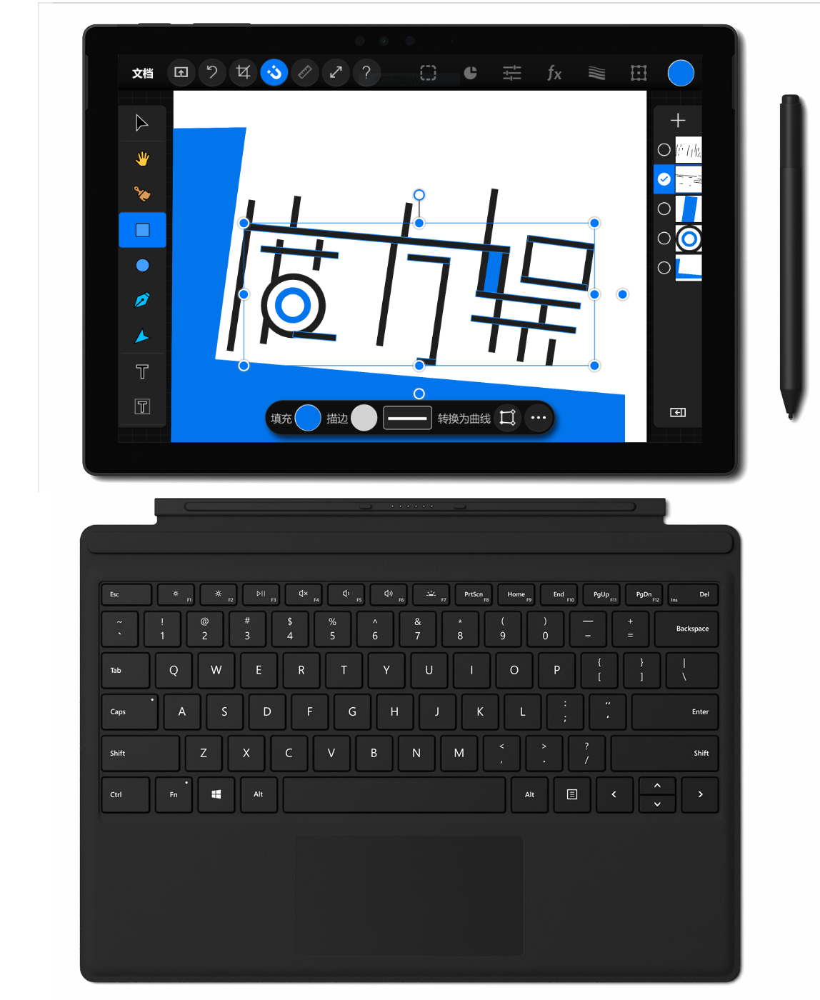
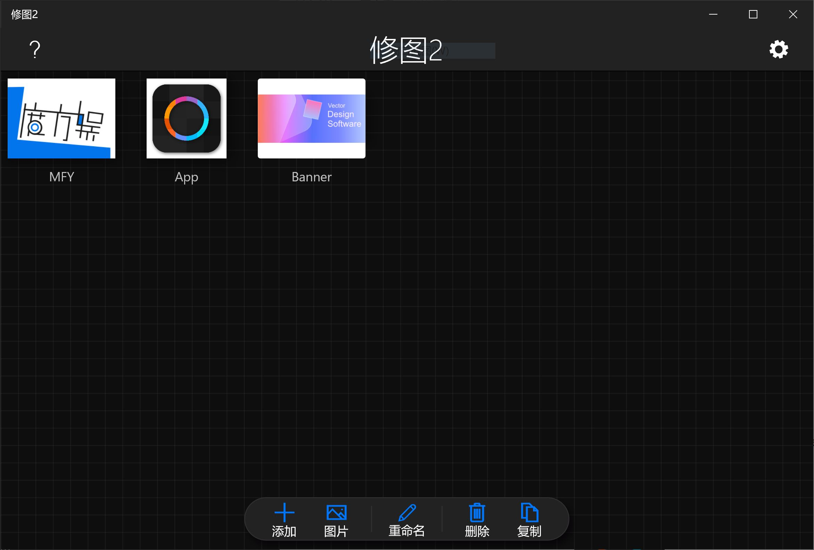
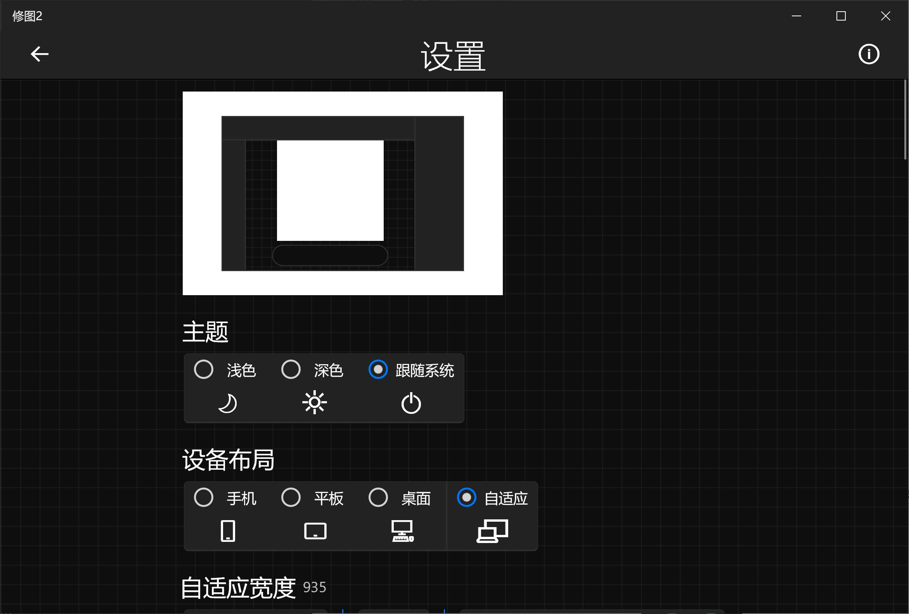
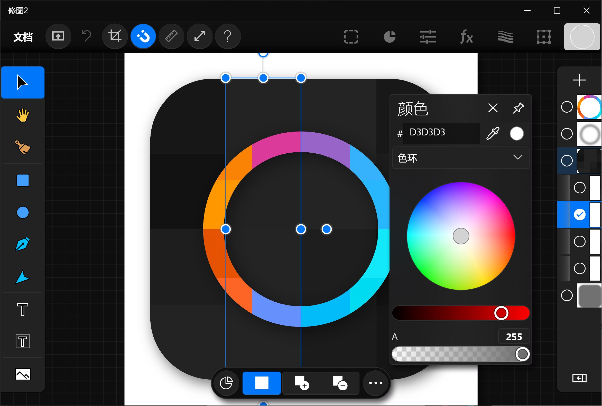
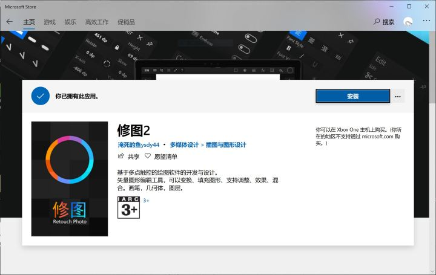

# 修图2 UWP V1.1.8正式版

Windows 10 应用商店地址： [Buy 修图2 UWP - Microsoft Store](https://www.microsoft.com/store/productId/9P76ZF661496)  
 
 

---

 

修图2 UWP V1.1.8正式版是一款设计工具类应用程序（工具人实锤了）

作为一款根植于Windows 10 平台的Universal Windows Platform应用，它是一款有着极高的自由度的矢量设计功能。

在使用 修图2 UWP 创建以及编辑矢量图形时，能给您带来流畅而优雅的UX体验，它可用于制作宣传海报、绘制矢量图形、二维插图。

## 关于设计
    
包含多种多样的功能，如编辑、排列、调整、图层FX、混合、变换、图层嵌套。

经过简化的操作方式，让你可以自由自在的展现脑海中的构想图；

也可以在主页面左上角寻找教程页面。

 

## 什么是矢量？

在所有图层都是矢量对象的理念下，连同字体也可转换为曲线，钢笔工具与节点工具可以用来更加精确的改变曲线形状。

 

## 关于布局

网格排列的项目文档，与下方的项目文档操作栏

列表面板中的设置

左工具，右图层，顶菜单，底应用栏...

---

 

修图2 UWP现已加入豪华午餐(划去)Windows 10 应用商店

废话不多说......

在应用商店搜索【修图2】【Retouch Photo2】【Retouch】皆可探寻到对应的主页