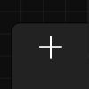
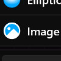
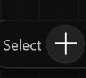
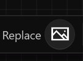

# **Gallery Page**
**Gallery Page is used to import and apply local images**
- [**Navigate_Gallery_Page**](#Navigate_Gallery_Page) 
- [**Add_Image**](#Add_Image) 

---
 

# **Navigate_Gallery_Page**

> **Layer Panel > Add Image**

 

> **Brush Tool > Fill Type > Image**

> **Brush Tool > Stroke Type > Image**

 

> **Image Tool > Select**

 

> **Image Tool > Replace**

---
 

# **Add_Image**
> **Once navigating into the gallery page, click the + button to add a local image to the gallery**

---
 

# **Apply_Image**
> **After you add a local image, click on the corresponding item in the grid view**