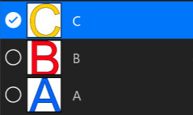
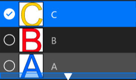

# **Layer Panel**
**Layer Panel is used to display, select, arrange, and nest all Layers**
- [**List_View**](#List_View)
- [**Select_Layers**](#Select_Layers) 
- [**Arrange_Layers**](#Arrange_Layers)
- [**Nest_Layers**](#Nest_Layers)

---
 

# **List_View**

> **The Layer List View is on the right side of the Application**

---
 

# **Select_Layers**

> **Click the Layer ListViewItem to select a Layer**

---
 

# **Arrange_Layers**

**Drag up and down the selected layer and release when the up and down arrowappears**

---
 

# **Nest_Layers**

**Drag up and down the selected layer and release it when the right arrow appears**

