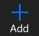
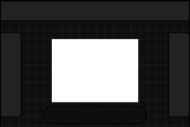
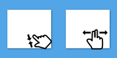
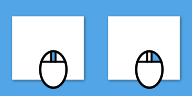

# **Basic Action**
- [**New_Project**](#New_Project) 
- [**Export_Project**](#Export_Project)
- [**UI_summary**](#UI_summary) 
- [**Moving_Scaling_Rotating_Canvas**](#Moving_Scaling_Rotating_Canvas)

---
 

# **New_Project**
**Click**

**to create a New Project**

---
 

# **Export_Project**
**Click**

**to export image file**

---
 

# **UI_summary**
 

**The area on the left is the Tool Panel**

**The area on the right is the Layer Panel**

**The top area is the Menu Panel**

**The bottom area is the App Bar**

---
 

# **Moving_Scaling_Rotating_Canvas**
|**Device**|**Summary**|**Example**|
|:-|:-|:-|
|**Touch**|**Pinch zoom, double-finger move**||
|**Mouse**|**Scroll the wheel to zoom, right-click drag and drop move**||

---