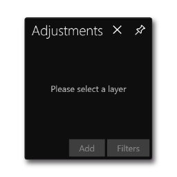
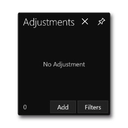
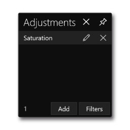
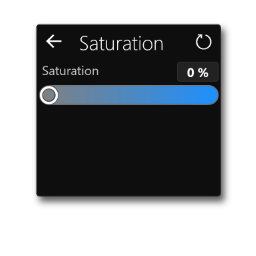
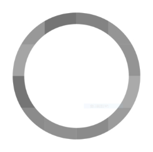
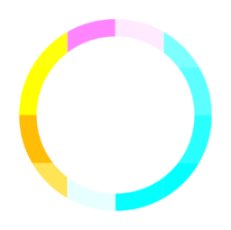

# **Adjustment Menu**
**Adjustment Menu is used to show, add, remove, and edit the adjustment of the layer**
- [**Show**](#Show)
- [**Add**](#Add)
   - [**Gray**](#Gray)
   - [**Invert**](#Invert)
   - [**Exposure**](#Exposure)
   - [**Brightness**](#Brightness)
   - [**Saturation**](#Saturation)
   - [**Hue_Rotation**](#Hue_Rotation)
   - [**Contrast**](#Contrast)
   - [**Temperature**](#Temperature)
   - [**Highlights_And_Shadows**](#Highlights_And_Shadows)
   - [**Gamma_Transfer**](#Gamma_Transfer)
   - [**Vignette**](#Vignette)
- [**Remove**](#Remove)
- [**Edit**](#Edit)
- [**Filter**](#Filter)

---
 

# **Show**

> **"Disable" state: No layer is selected, select a layer**

 

> **"Zero" state: There is no adjustment to the current layer**

 

> **"Adjustments" state: Shows all adjustments to the current layer**

 

> **"Edit" state: Edit the current adjustment of the current layer**

---
 

# **Add**

> **Click the "Add" button to select the adjustment and add the adjustment to the layer**

---
 

### **Gray**

---
 

### **Invert**

---
 

### **Exposure**
    

---
 

### **Brightness**
 

 

---
 

### **Saturation**
 

 

---
 

### **Hue_Rotation**
 

   

---
 

### **Contrast**
  

---
 

### **Temperature**

---
 

### **Highlights_And_Shadows**

---
 

### **Gamma_Transfer**

---
 

### **Vignette**

---
 

# **Remove**

> **Remove an adjustment to the layer**

---
 

# **Edit**

> **Navigate to second page**

> **Edit an adjustment in the layer**

---
 

# **Filter**

> **Click the “Filter” button to select a filter to change all adjustments to the layer**