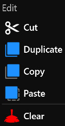
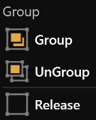
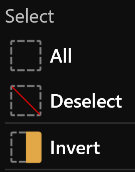
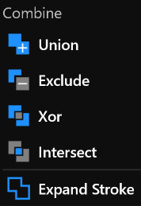

# **Edit Menu**
**Edit Menu provides editing, grouping, selection, combine and more**
- [**Edit**](#Edit)
- [**Group**](#Group)
- [**Select**](#Select)
- [**Combine**](#Combine)

---
 

## **Edit**

|**Button**|**Summary**|
|:-|:-|
|**Cut**|**Remove the selected layers and put it on the clipboard**|
|**Duplicate**|**Insert a duplicate of the selected layer**|
|**Copy**|**Copy the selected layers to the clipboard**|
|**Paste**|**Insert the layers of the clipboard at the location**|
|**Clear**|**Clear the selected layers**|

---
 

## **Group**

|**Button**|**Summary**|
|:-|:-|
|**Group**|**Place the selected layer in a nested Group Layer**|
|**UnGroup**|**Releases the children layers of the Group Layer and clears the Group Layer**|
|**Release**|**Releases the children layers of the layer**|

---
 

## **Select**

|**Button**|**Summary**|
|:-|:-|
|**All**|**Select all layers**|
|**Deselect**|**Unselect all layers**|
|**Invert**|**Select all unselected layers, Unselect all selected layers**|

---
 

## **Combine**

|**Button**|**Summary**|
|:-|:-|
|**Union**|**The result geometry contains the set of all areas from either of the source geometries**|
|**Exclude**|**The result geometry contains just the areas where the source geometries overlap**|
|**Xor**|**The result geometry contains the areas from both the source geometries, except for any parts where they overlap**|
|**Intersect**|**The result geometry contains any area that is in the first source geometry- but  excludes any area belonging to the second geometry**|
|**Expand Stroke**|**Returns a geometry equivalent to a stroked area of this geometry, with the specified stroke width and a default stroke style**|

 

> **"Expand Stroke": The selected layer must have a stroke, or the stroke width is not zero**