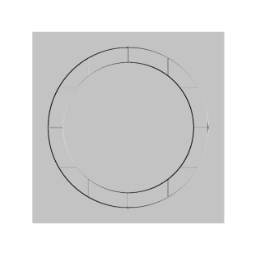

## **图层FX菜单**
**Layer FX Menu provides gaussian blur, sharpen, outer shadow, emboss, and more**
- [**Gaussian_Blur**](#Gaussian_Blur)
- [**Directional_Blur**](#Directional_Blur)
- [**Sharpen**](#Sharpen)
- [**Outer_Shadow**](#Outer_Shadow)
- [**Edge**](#Edge)
- [**Morphology**](#Morphology)
- [**Emboss**](#Emboss)
- [**Straighten**](#Straighten)

---
 

## **Gaussian_Blur**

---
 

## **Directional_Blur**

---
 

## **Sharpen**

---
 

## **Outer_Shadow**

---
 

## **Edge**

---
 

## **Morphology**

---
 

## **Emboss**

---
 

## **Straighten**

