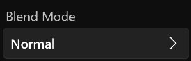

# **Layer Menu**
**The layer menu is used to modify properties such as the name of the layer, opacity, blend mode, visibility, and tag type**
> **You can double-click or right-click the Layer Item to display the Layer Menu**

- [**Name**](#Name)
- [**Opacity**](#Opacity)
- [**Blend_Mode**](#Blend_Mode)
- [**Visibility**](#Visibility)
- [**Tag_Type**](#Tag_Type)

---
 

## **Name**

> **Change the name of the layer**

---
 

## **Opacity**

> **Change the opacity of the layer**

---
 

## **Blend_Mode**

> **A blend-mode that combines two layers**

|**Mode**|**Summary**|
|:-|:-|
|**Normal**|**Default**|
|**Multiply**|**The result of the blend ingtakes is a combination of top and bottom colors for each pixel position, resulting in darker values**|
|**Screen**|**The opposite result of a positive stacking, the result of the blend ingenuation is a combination of the top and bottom colors of each pixel position, resulting in a brighter value**|
|**Color Bum**|**The value of the top color pixel deepens the underlying color pixel**| 
|**Overlay**|**Apply a positive underlay or screen Blend_Mode based on the bottom color of each pixel position. If the grayscale of the bottom layer pixel is 50, the positive stack ingauation mode is applied, and if 50, the screen mode is applied**|

---
 

## **Visibility**

> **When Unselected: The layer does not visible**

---
 

## **Tag_Type**

> **Colorful layer tags**