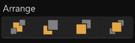
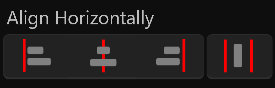

# **Operate Menu**
**Operate Menu provides transform, arrangement, horizontally alignment, vertically alignment, and more**
- [**Transform**](#Transform)
- [**Arrange**](#Arrange)
- [**Horizontally_Alignment**](#Horizontally_Alignment)
- [**Vertical_Alignment**](#Vertical_Alignment)

---
 

# **Transform**

|**Button**|**Summary**|
|:-|:-|
|**Flip Horizontal**|**Zoom the selected layer (-1, 0)**|
|**Flip Vertical**|**Zoom the selected layer (0, -1)**|
|**Rotate Left**|**Rotate the selected layer -90º**|
|**Rotate Right**|**Rotate the selected layer 90º**|

---
 

# **Arrange**

|**Button**|**Summary**|
|:-|:-|
|**Move To Back**|**In the list, the current layer is the last**|
|**Back One**|**In the list, the index of the current layer + 1**|
|**Forward One**|**In the list, the index of the current layer-1**|
|**Move To Front**|**In the list, the index of the current layer is 0**|

---
 

# **Horizontally_Alignment**

|**Button**|**Summary**|
|:-|:-|
|**Align Left**|**Aligns the selected layer to the left edge**|
|**Align Center**|**Align the selected layers to the center**|
|**Align Right**|**Aligns the selected layer to the left edge**|
|**Space Horizontally**|**Distribute the selected layers evenly horizontally**|

---
 

# **Vertical_Alignment**

|**Button**|**Summary**|
|:-|:-|
|**Align Top**|**将所选图层与上边缘对齐**|
|**Align Middle**|**将所选图层与中间对齐**|
|**Align Bottom**|**Align the selected layer to the bottom edge**|
|**Space Vertically**|**Distribute the selected layers evenly vertically**|

---
 

> **When there is only one selected layer, the selected layer is aligned to the edge of the canvas**

 

> **When there are multiple selected layers, the selected layers are aligned to the edge of the selected layer**

 

> **"Space Horizontally" ”Space Vertically”：There must be three or more selected layers**

