# **Stroke Menu**
**Stroke Menu is used to modify the dash, stroke width, dot, join, offset, and other properties of the stroke style**
- [**Dash**](#Dash)
- [**Stroke_Width**](#Stroke_Width)
- [**Cap**](#Cap)
- [**Join**](#Join)
- [**Offset**](#Offset)
- [**Style_transform_with_Layer**](#Style_transform_with_Layer)
- [**Stroke_behind_Fill**](#Stroke_behind_Fill)
- [**Stroke_Width_scale_with_Layer**](#Stroke_Width_scale_with_Layer)

---
 

# **Dash**
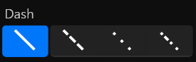

|**Button**|**Summary**|
|:-|:-|
|**Solid**|**——————**|
|**Dash**|**— — — — —**|
|**Dot**|**· · · · · · · · · · · ·**|
|**Dash Dot**|**· — · · — · · —**|

---
 

# **Stroke_Width**
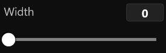
> **The width of the stroke**

---
 

# **Cap**
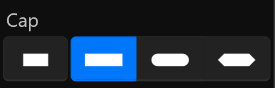

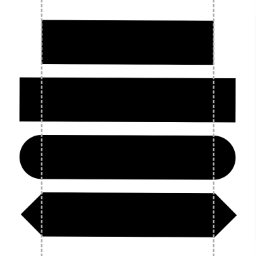

|**Button**|**Summary**|
|:-|:-|
|**Flat**|**No Caps**|
|**Square**|**Half of a square that has a length equal to the line thickness**|
|**Round**|**A semicircle that has a diameter equal to the line thickness**|
|**Triangle**|**An isosceles right triangle whose hypotenuse is equal in length to the thickness of the line**|

> **A Line: Contains the end sands of both Dots and the straight Dash in the middle**

> **If "Cap" is set to "Flat", Dots will have zero size so only Dashes are visible**

---
 

# **Join**

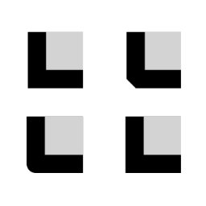

|**Button**|**Summary**|
|:-|:-|
|**Miter**|**Line joins use regular angular vertices.**|
|**Bevel**|**Line joins use beveled vertices**|
|**Round**|**Line joins use rounded vertices**|
|**Miter or Bevel**|**Regular angular vertices unless the join would extend beyond the miter limit; otherwise, beveled vertices**|

---
 

# **Offset**
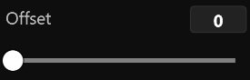
> **The distance from which the stroke path begins**

---
 

## **Style_transform_with_Layer**
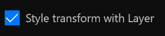
> **When Selected: The control point position of the style brush follows the transformation of the layer**

 

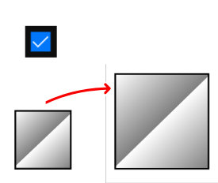

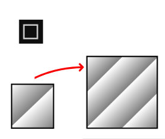

---
 

## **Stroke_behind_Fill**

> **When Selected: The stroke of the style is after the fill**

 

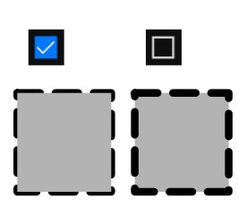

---
 

## **Stroke_Width_scale_with_Layer**
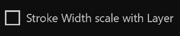
> **"When Selected: The stroke width of the style follows the scale of the layer**

 

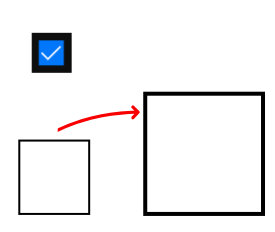

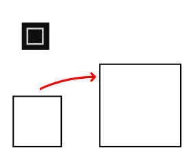