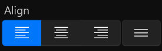
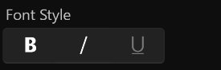
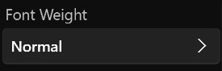
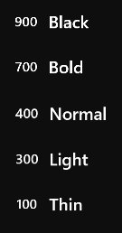
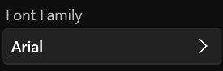
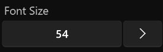

# **Text Menu**
**Font Menu is used to modify the alignment of text, font style, font weight, font size, and other properties**
- [**Alignment**](#Alignment)
- [**Font_Style**](#Font_Style)
- [**Font_Weight**](#Font_Weight)
- [**Font_Family**](#Font_Family)
- [**Font_Size**](#Font_Size)

---
 

# **Alignment**

|**Button**|**Summary**|
|:-|:-|
|**Left Alignment**|**The left edge of the text is aligned to the left edge of the layout box**|
|**Center Alignment**|**The center of the text is aligned to the center of the layout box**|
|**right Alignment**|**The right edge of the text is aligned to the right edge of the layout box**|
|**Justify**|**The left edge of the text is aligned to the left edge of the layout box and broken lines are aligned to the right edge**|

---
 

# **Font_Style**

|**Button**|
|:-|
|**Bold**|
|**Italic**|
|**Underline**|

---
 

# **Font_Weight**

|**Mode**|**Weight**|
|:-|:-|
|**Black**|**900**|
|**Bold**|**700**|
|**Normal**|**400**|
|**Light**|**300**|
|**Thin**|**100**|

---
 

# **Font_Family**

> **Find all available FontFamilys from your device**

---
 

# **Font_Size**
