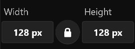
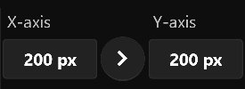
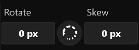
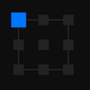

# **Transform Menu**
**Transform Menu provides scale, move, rotate, shear, and more**
- [**Scale**](#Scale)
- [**Move**](#Move)
- [**Rotate_And_Shear**](#Rotate_And_Shear)
- [**Anchor_Indicator**](#Anchor_Indicator)

---
 

# **Scale**

|**Button**|**Summary**|
|:-|:-|
|**Width**|**Layer width  (relation to the selected anchor point)**|
|**Ratio Scaling**|**When enabled, the width and height remain the current aspect ratio**|
|**Height**|**Layer height  (relation to the selected anchor point)**|

---
 

# **Move**

|**Button**|**Summary**|
|:-|:-|
|**X-Axis**|**Horizontal position**|
|**Position Remote**|**Navigate to Second Page**|
|**Y-Axis**|**Vertical position**|

> **"Position Remote" is on the Second Page**

---
 

# **Rotate_And_Shear**

|**Button**|**Summary**|
|:-|:-|
|**Rotation**|**Rotation  (relation to the selected anchor point)**|
|**Step Frequency**|**When rotating，capture 15 degrees of rotation angle**|
|**Shear**|**Shear  (relation to the selected anchor point)**|

---
 

# **Anchor_Indicator**

> **Click on an anchor point to select**

> **If the upper-left anchor point of the Anchor Indicator is selected, the center point of the transformation is in the upper-left corner of the layer**