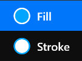

# **Brush Tool**
**Brush Tool is used to modify properties such as fills, strokes, and so on for a layer**
- [**Fill_or_Stroke**](#Fill_or_Stroke)
- [**Type**](#Type)
- [**Fill**](#Fill)
- [**Stroke**](#Stroke)

> **A brush defines the color of things being drawn. It can be a solid color, or  a bitmap pattern, or a gradient**

---
 

# **Fill_or_Stroke**

> **A layer contains 2 brushes: the Fill Brush and the Stroke Brush**

|**Type**|**Summary**|
|:-|:-|
|**Fill**|**A brush used to fill the inner area of the shape**|
|**Stroke**|**A brush used to specify how shape outlines are drawn**|

---
 

# **Type**

> **Brushes contain 6 different types**

|**Type**|**Summary**|
|:-|:-|
|**None**|**Nothing**|
|**Color**|**Paints shape a solid color**|
|**Linear**|**A brush used to paint a linear gradient**|
|**Radial**|**A brush used to paint a radial gradient**|
|**Elliptical**|**A brush used to paint a elliptical gradient**|
|**Image**|**A brush which paints using image content, such as a bitmap**|

> **Image brush can be used to producing  tiled backgrounds, or filling geometry with a pattern**

---
 

# **Brush**

> **Brush types vary, and the flyout menu sdisplayed when clicked is different**

|**Type**|**Summary**|
|:-|:-|
|**None**|**Nothing**|
|**Color**|**Click to select the gradient**|
|**Linear**|**Click to select the gradient**|
|**Radial**|**Click to select the gradient**|
|**Elliptical**|**Click to select the gradient**|
|**Image**|**Click to enter the Gallery Page**|

> **When you use a Image Brush, you must select a image from the Gallery Page**

---
 

# **Extend**

> **Specifies the way in which a brush paints areas outside its typical**

|**Type**|**Summary**|
|:-|:-|
|**Clamp**|**Repeat the edge pixels of the brush's content**|
|**Wrap**|**Tile the brush's content**|
|**Mirror**|**Tile the the brush's content, and flip each alternate tile**| 

