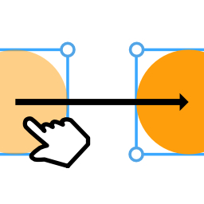
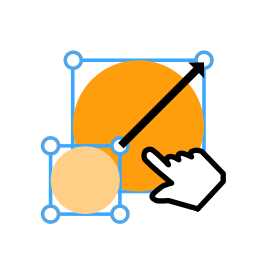
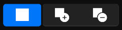
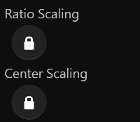

# **Cursor Tool**
**Cursor Tool provides functions such as movement, transformation, selection, and more**
- [**Move**](#Move)
- [**Transform**](#Transform)
- [**Select**](#Select)
- [**More**](#More)

---
 

# **Move**

> **Move the layer**

---
 

# **Transform**

> **Resize the layer**

---
 

# **Select**

> **Click to select Layer**

> **Box select layer**

 

|**Button**|**Summary**|**Shortcuts**|
|:-|:-|:-|
|**New**|**Click to select a layer**||
|**Add**|**Multi-select**|**(Shift)**|
|**Subtract**|**Multi-select**|**(Ctrl)**|

---
 

# **More**

|**Button**|**Summary**|**Shortcuts**|
|:-|:-|:-|
|**Ratio Scaling**|**When enabled, the width and height remain the current aspect ratio**|**(Shift)**|
|**Center Scaling**|**The anchor point is in the center of the layer when you scale the layer**|**(Ctrl)**|