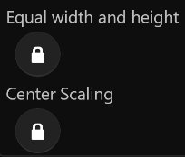


# **Rectangle Tool**
**Rectangle Tool can be used to create Rectangle Layer**

---

 
  

---

# **Ellipse Tool**
**Ellipse Tool can be used to create Ellipse Layer**

---

 
  

---

# **Round Rectangle Tool**
**Round Rectangle Tool can be used to create Round Rectangle Layer**

---

 
  

---

# **Triangle Tool**
**RoundRectangle Tool can be used to create Triangle Layer**

---

 
  

---

# **Diamond Tool**
**RoundRectangle Tool can be used to create Diamond Layer**

---

 
  

---

# **Pentagon Tool**
**RoundRectangle Tool can be used to create Pentagon Layer**

---

 
  

---

# **Star Tool**
**RoundRectangle Tool can be used to create Star Layer**

---

 
  

---

# **Cog Tool**
**RoundRectangle Tool can be used to create Cog Layer**

---

 
  

---

# **Dount Tool**
**RoundRectangle Tool can be used to create Dount Layer**

---

 
  

---

# **Pie Tool**
**RoundRectangle Tool can be used to create Pie Layer**

---

 
  

---

# **Cookie Tool**
**RoundRectangle Tool can be used to create Cookie Layer**

---

 
  

---

# **Arrow Tool**
**RoundRectangle Tool can be used to create Arrow Layer**

---

 
  

---

# **Capsule Tool**
**RoundRectangle Tool can be used to create Capsule Layer**

- [**Convert_to_Curves**](#Convert_to_Curves)
- [**More**](#More)
> **Drag and drop a distance on the canvas to create a Curve Layer**

---
  

# **Convert_to_Curves**

> **Convert Geometry Layer、Text Layer、Image Layer to Curves Layer**

---
  

# **More**

|**Type**|**Summary**|**Shortcut**|
|:-|:-|:-|
|**Equal width and height**|**The layer you create is equal in width to height**|**(Shift)**|
|**Center Scaling**|**The center point of the layer you create is the starting point of the drag**|**(Ctrl)**|