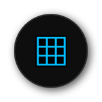
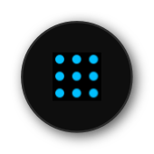


# **Grid Tool**
**Grid Tool can be used to create Grid Layer**

---

 
  

---

# **Diagonal Tool**
**Diagonal Tool can be used to create Diagonal Layer**

---

 
  

---

# **Spotted Tool**
**Spotted Tool can be used to create Spotted Layer**