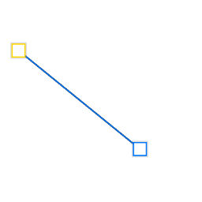
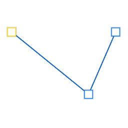
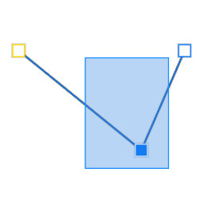
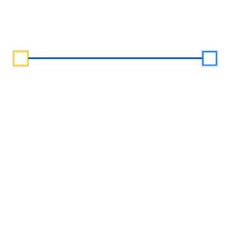
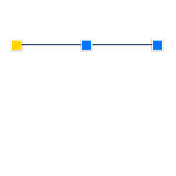
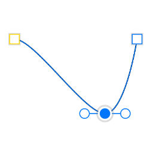
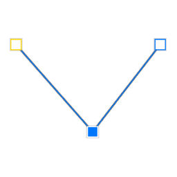
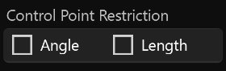
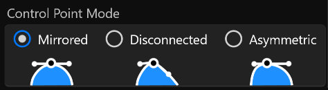

# **Pen Tool**
**Pen Tool can be used to create Curve Layer and add nodes to Curve Layer**
- [**Create_Curve**](#Create_Curve)
- [**Add_Node**](#Add_Node)

---
 

# **Create_Curve**

> **Click the canvas and drag to create a Curve Layer**

---
 

# **Add_Node**

> **Select the Curve Layer and click on the canvas to increase the curve node at the end of the curve**

---

 
  

---

# **Node Tool**
**Node Tool can be used to select, move, remove, insert, smooth, sharp curve nodes**
- [**Select_Node**](#Select_Node)
- [**Move_Node**](#Move_Node)
- [**Remove_Node**](#Remove_Node)
- [**Insert_Node**](#Insert_Node)
- [**Smooth_Node**](#Smooth_Node)
- [**Sharp_Node**](#Sharp_Node)
- [**More**](#More)

---
 

# **Select_Node**

> **Click select node or box select node**

---
 

# **Move_Node**

> **Click on the selected node and drag to move the node**

---
 

# **Remove_Node**

> **Remove all selected nodes**

---
 

# **Insert_Node**

> **In the middle of the two selected nodes, insert a new node**

---
 

# **Smooth_Node**

> **Smooth all selected nodes and display the left and right control points**

---
 

# **Sharp_Node**

> **Sharpen all selected nodes and hide the left and right control points**

---
 

# **More**

|**Button**|**Summary**|**Shortcuts**|
|:-|:-|:-|
|**Angle**|**The Angle is not changed when the control point is moved**|**(Shift)**|
|**Length**|**The Length is not changed when the control point is moved**|**(Ctrl)**|

 

|**Button**|**Summary**|
|:-|:-|:-|
|**Mirrored**|**The right control point remains symmetrical when the left control point is moved**|
|**Disconnected**|**The right control point does not change position when the left control point is moved**|
|**Asymmetric**|**The right control point is asymmetric when the left control point is moved**|