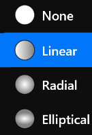
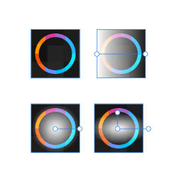

# **Transparency Tool**
**Transparency Tool is used to modify the transparent gradient of a layer.**
- [**Type**](#Type)
- [**Brush**](#Brush)

---
 

# **Type**

> **Brushes contain 4 different types**

|**Type**|**Summary**|
|:-|:-|
|**None**|**Nothing**|
|**Linear**|**A brush used to paint a linear gradient**|
|**Radial**|**A brush used to paint a radial gradient**|
|**Elliptical**|**A brush used to paint a elliptical gradient**|

---
 

# **Brush**
