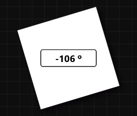
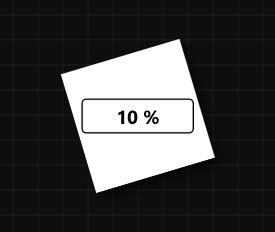

# **View Tool**
**View Tool is used to modify properties such as the canvas's rotation radian, scale**
- [**Rotation_Radian**](#Rotation_Radian)
- [**Scale**](#Scale)

---
 

# **Rotate_Radian**

> **Change the rotation radian to rotate the canvas**

---
 

# **Scale**

> **Change the scale to scale the canvas**