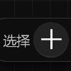
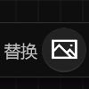

# **图库页**
**图库页用来导入并应用本地图像**
- [**导航图库页**](#导航图库页) 
- [**添加图像**](#添加图像) 

---
 

# **导航图库页**

> **图层栏 > 添加图像**

 

> **笔刷工具 > 填充类型 > 图像**

> **笔刷工具 > 描边类型 > 图像**

 

> **图像工具 > 选择**

 

> **图像工具 > 替换**

---
 

# **添加图像**
> **导航进入图库页后，点击 + 按钮在图库里添加本地图像**

---
 

# **应用图像**
> **添加本地图像后，点击网格视图中对应的子项**