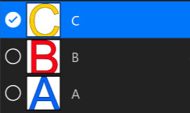
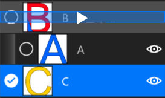

# **图层**
- [**图层列表视图**](#图层列表视图) 
- [**选择图层**](#选择图层) 
- [**排列图层**](#排列图层)
- [**嵌套图层**](#嵌套图层)

---
 

# **图层列表视图**

> **图层列表视图在应用程序右侧**

---
 

# **选择图层**

> **Click the Layer ListViewItem to select a Layer**

---
 

# **排列图层**

**上下拖拽选定图层，出现上下箭头时松开**

---
 

# **嵌套图层**

**上下拖拽选定图层，出现右箭头时松开**

