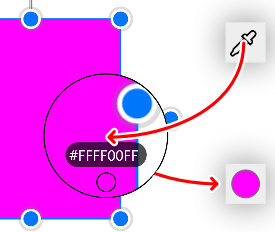

# **颜色菜单**
**颜色菜单用来修改颜色的A、RGB、HSV等属性**
- [**A**](#A)
- [**RGB**](#RGB)
- [**HSV**](#HSV)
- [**Straw**](#Straw)
- [**Hex**](#Hex)

---
 

# **A**

|**按钮**|**介绍**|**范围**|
|:-|:-|:-|
|**A**|**Alpha Channel**|**( 0 < R < 255 )**|

---
 

# **RGB**

|**按钮**|**介绍**|**范围**|
|:-|:-|:-|
|**R**|**Red Channel**|**( 0 < R < 255 )**|
|**G**|**Green Channel**|**( 0 < G < 255 )**|
|**B**|**Blue Channel**|**( 0 < B < 255 )**|

---
 

# **HSV**

|**按钮**|**介绍**|**范围**|
|:-|:-|:-|
|**H**|**Hue Component**|**( 0° < H < 360° )**|
|**S**|**Saturation Component**|**( 0% < S < 100% )**|
|**V**|**Value Component**|**( 0% < V < 100% )**|

---
 

# **Straw**

> **1.Drag the icon to select the color**

> **2.Click on the circle to change the color**

---
 

# **Hex**

**In mathematics and computing, hexadecimal (also base, or hex) are a positional numeral system with a radix, or base, of It uses sixteen distinct symbols, most often the symbols 0–9 to represent values zero to nine, and a–f (or alternative Ly a–f) to the represent values ten to fifteen**

    <White>  #FFFFFF  255,255,255</White>
    <Black>  #000000  0,0,0</Black>    
    <Red>  #FF0000  255,0,0<LineBreak/>
    <Green>  #00FF00  0,255,0<LineBreak/>
    <Blue>  #0000FF  0,0,255<LineBreak/>
                                                 
    <LightPink>  #FFB6C1  255,182,193<LineBreak/>
    <Pink>  #FFC0CB  255,192,203<LineBreak/>
    <Crimson>  #DC143C  220,20,60<LineBreak/>
    <LavenderBlush>  #FFF0F5  255,240,245    
    <PaleVioletRed>  #DB7093  219,112,147    
    <HotPink>  #FF69B4  255,105,180<LineBreak/>
    <DeepPink>  #FF1493  255,20,147<LineBreak/>
    <MediumVioletRed>  #C71585  199,21,133    
    <Orchid>  #DA70D6  218,112,214<LineBreak/>
    <Thistle>  #D8BFD8  216,191,216<LineBreak/>
    <Plum>  #DDA0DD  221,160,221<LineBreak/>
    <Violet>  #EE82EE  238,130,238<LineBreak/>
    <Magenta>  #FF00FF  255,0,255  <LineBreak/>