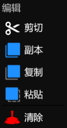
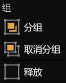
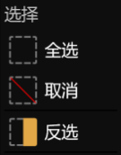
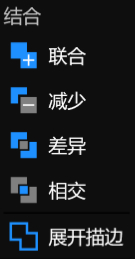

# **编辑菜单**
**编辑菜单提供了编辑、组、选择、结合等功能**
- [**编辑**](#编辑)
- [**组**](#组)
- [**选择**](#选择)
- [**结合**](#结合)

---
 

## **编辑**

|**按钮**|**介绍**|
|:-|:-|
|**剪切**|**Remove the selected layers and put it on the clipboard**|
|**副本**|**插入选定图层的副本**|
|**复制**|**Copy the selected layers to the clipboard**|
|**粘贴**|**Insert the layers of the clipboard at the location**|
|**清除**|**Clear the selected layers**|

---
 

## **组**

|**按钮**|**介绍**|
|:-|:-|
|**分组**|**将选定图层放在一个嵌套的组图层里面**|
|**取消分组**|**将组图层的子图层释放出来，并清除组图层**|
|**释放**|**将图层的子图层释放出来**|

---
 

## **选择**

|**按钮**|**介绍**|
|:-|:-|
|**全选**|**Select all layers**|
|**取消**|**Unselect all layers**|
|**反选**|**Select all unselected layers, Unselect all selected layers**|

---
 

## **结合**

|**按钮**|**介绍**|
|:-|:-|
|**联合**|**The result geometry contains the set of all areas from either of the source geometries**|
|**减少**|**The result geometry contains just the areas where the source geometries overlap**|
|**差异**|**The result geometry contains the areas from both the source geometries, except for any parts where they overlap**|
|**相交**|**The result geometry contains any area that is in the first source geometry- but  excludes any area belonging to the second geometry**|
|**展开描边**|**Returns a geometry equivalent to a stroked area of this geometry, with the specified stroke width and a default stroke style**|

 

> **“展开描边”：选定图层必须有描边，或者描边宽度不为零**