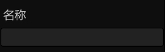
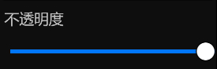
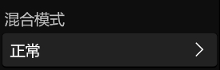
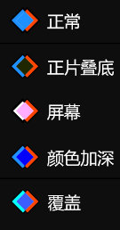
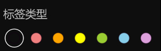

# **图层菜单**
**图层菜单用来修改图层的属性**
> **你可以双击或者右键图层项来显示图层菜单**

- [**名称**](#名称)
- [**不透明度**](#不透明度)
- [**混合模式**](#混合模式)
- [**可视**](#可视)
- [**样式跟随变换**](#样式跟随变换)
- [**标签类型**](#标签类型)

---
## **名称**

---
## **不透明度**

---
## **混合模式**

|**模式**|**介绍**|
|:-|:-|
|**正常**|**默认**|
|**正片叠底**|**混合结果为每个像素位置的顶层和底层颜色组合，从而产生较暗的值**|
|**屏幕**|**正片叠底的相反结果，混合结果为每个像素位置的顶层和底层颜色逆反组合，从而产生较亮的值**|
|**颜色加深**|**相对顶层颜色像素的值加深底层颜色像素**| 
|**覆盖**|**根据每个像素位置的底部颜色应用正片叠底或屏幕混合模式。如果底部图层像素的灰度 <50%，则应用正片叠底模式；如果 >50%，则应用屏幕模式**|

---
## **可视**

---
## **样式跟随变换**

---
## **标签类型**

---