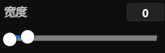
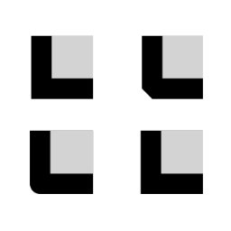

# **描边菜单**
**描边菜单用来修改描边样式的破折、宽度、端点、拐角、偏移等属性**
- [**破折**](#破折)
- [**宽度**](#宽度)
- [**端点**](#端点)
- [**拐角**](#拐角)
- [**偏移**](#偏移)

---
 

# **破折**

|**按钮**|**介绍**|
|:-|:-|
|**固体**|**——————**|
|**破折**|**— — — — —**|
|**端点**|**· · · · · · · · · · · ·**|
|**破折 端点**|**· — · · — · · —**|

---
 

# **宽度**

---
 

# **端点**

|**按钮**|**介绍**|
|:-|:-|
|**平面**|**无端点**|
|**正方形**|**一个高度等于直线粗细、长度等于直线粗细一半的矩形**|
|**圆形**|**一个直径等于直线粗细的半圆形**|
|**三角形**|**一个底边长度等于直线粗细的等腰直角三角形**|

> 一个破折：包含两头的端点+中间的直线

---
 

# **拐角**

|**按钮**|**介绍**|
|:-|:-|
|**尖角**|**线条联接使用常规角顶点**|
|**斜角**|**线条联接使用斜角顶点**|
|**圆角**|**线条联接使用圆角顶点**|
|**尖角和斜角**|**Regular angular vertices unless the join would extend beyond the miter limit; otherwise, beveled vertices**|

---
 

# **偏移**

> 路径开始的距离