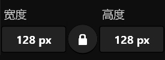
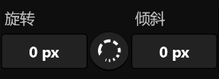

# **操作菜单**
**变换菜单提供了缩放、移动、旋转、倾斜等功能**
- [**缩放**](#缩放)
- [**移动**](#移动)
- [**旋转与倾斜**](#旋转与倾斜)
- [**锚点指示器**](#锚点指示器)

---
 

# **缩放**

|**按钮**|**介绍**|
|:-|:-|
|**宽度**|**Layer width  (relation to the selected anchor point)**|
|**等比例缩放**|**When enabled, the width and height remain the current aspect ratio**|
|**高度**|**Layer height  (relation to the selected anchor point)**|

---
 

# **移动**

|**按钮**|**介绍**|
|:-|:-|
|**X-轴**|**Horizontal position**|
|**位置遥控**|**Navigate to second page**|
|**Y-轴**|**Vertical position**|

> **“位置遥控”在第二页面**

---
 

# **旋转与倾斜**

|**按钮**|**介绍**|
|:-|:-|
|**旋转**|**Rotation  (relation to the selected anchor point)**|
|**步频**|**When rotating，capture 15 degrees of rotation angle**|
|**倾斜**|**Shear  (relation to the selected anchor point)**|

---
 

# **锚点指示器**

> **Click on an anchor point to select**

> **If the upper-left anchor point of the anchor indicator is selected, the center point of the transformation is in the upper-left corner of the layer**

