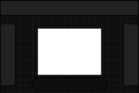
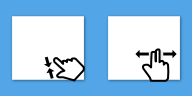
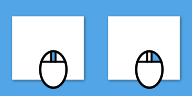

# **基本操作**
- [**新建项目**](#新建项目) 
- [**导出项目**](#导出项目)
- [**UI概述**](#UI概述) 
- [**平移缩放旋转画布**](#平移缩放旋转画布)

---
# **新建项目**
**点击**

**新建项目**

---
# **导出项目**
**点击**

**导出图像**

---
# **UI概述**
 

**左侧区域为工具栏**

**右侧区域为图层栏**

**顶部区域为菜单栏**

**底部区域为应用栏**

---
# **平移缩放旋转画布**
|**设备**|**介绍**|**示例**|
|:-|:-|:-|
|**触摸**|**捏合缩放、双指平移**||
|**鼠标**|**滚轮滚动缩放、右键拖拽平移**||

---