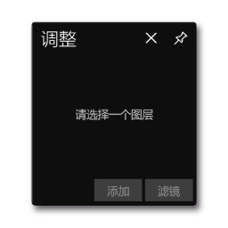
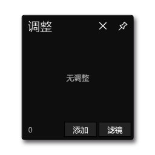
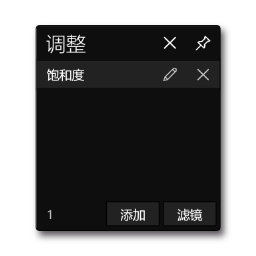
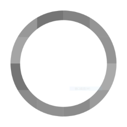
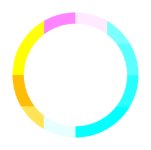
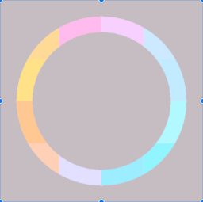

# **调整菜单**
**调整菜单用来展示、添加、移除、编辑图层的调整**
- [**展示**](#展示)
- [**添加**](#添加)
- [**移除**](#移除)
- [**编辑**](#编辑)
- [**滤镜**](#滤镜)

---
 

# **展示**

> **“不可用”状态：没有选定图层，请选择一个图层**

 

> **“零”状态：当前图层无调整**

 

> **“调整"状态：展示当前图层的所有调整**

 

> **”编辑"状态：编辑当前图层的当前调整**

---
 

# **添加**

> **单击"添加"按钮，选择调整，并将调整添加到图层**

---
 

## **黑白**

---
 

## **反色**

---
 

## **曝光**
    

---
 

## **亮度**
 

 

---
 

## **饱和度**
 

 

---
 

## **色相旋转**
 

   

---
 

## **对比度**
  

---
 

## **冷暖**

---
 

## **高光阴影**

---
 

## **伽马传递**

---
 

## **装饰图案**

---
 

# **移除**

> **“移除图层的一个调整**

---
 

# **编辑**

> **Navigate to second page**

> **编辑图层的一个调整**

---
 

# **滤镜**

> **单击"滤镜"按钮，选择滤镜来改变图层的所有调整**