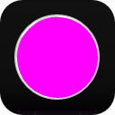

# **颜色菜单**
**颜色菜单用来修改颜色的A、RGB、HSV等属性**
- [**A**](#A)
- [**RGB**](#RGB)
- [**HSV**](#HSV)
- [**吸管**](#吸管)
- [**十六进制**](#十六进制)

---
 

# **A**

|**按钮**|**介绍**|**范围**|
|:-|:-|:-|
|**A**|**阿尔法通道**|**( 0 < R < 255 )**|

---
 

# **RGB**

|**按钮**|**介绍**|**范围**|
|:-|:-|:-|
|**R**|**红色通道**|**( 0 < R < 255 )**|
|**G**|**绿色通道**|**( 0 < G < 255 )**|
|**B**|**蓝色通道**|**( 0 < B < 255 )**|

---
 

# **HSV**

|**按钮**|**介绍**|**范围**|
|:-|:-|:-|
|**H**|**色相分量**|**( 0° < H < 360° )**|
|**S**|**饱和度分量**|**( 0% < S < 100% )**|
|**V**|**明度分量**|**( 0% < V < 100% )**|

---
 

# **吸管**

> **1.拖动图标以选择颜色**

> **2.单击圆圈以更改颜色**

---
 

# **十六进制**

**在数学和计算中，十六进制（也是基数或十六进制）是一个位置数字系统，它使用 16 个不同的符号，通常表示 0 到 9 的符号，以及 a=f（或替代 Ly a=f）表示值 10 到 15**

    <白色>  #FFFFFF  255,255,255 </白色>
    <黑色>  #000000  0,0,0 </黑色>    
    <红色>  #FF0000  255,0,0 </红色><LineBreak/>
    <绿色>  #00FF00  0,255,0 </绿色><LineBreak/>
    <蓝色>  #0000FF  0,0,255 </蓝色><LineBreak/>
                                                 
    <光粉红>  #FFB6C1  255,182,193 </光粉红><LineBreak/>
    <粉红色>  #FFC0CB  255,192,203 </粉红色><LineBreak/>
    <深红色>  #DC143C  220,20,60 </深红色><LineBreak/>
    <薰衣草布卢什>  #FFF0F5  255,240,245 </薰衣草布卢什>    
    <帕莱紫罗兰>  #DB7093  219,112,147 </帕莱紫罗兰>    
    <热粉红>  #FF69B4  255,105,180 </热粉红><LineBreak/>
    <深粉红>  #FF1493  255,20,147 </深粉红><LineBreak/>
    <中紫罗兰>  #C71585  199,21,133 </中紫罗兰>    
    <兰花>  #DA70D6  218,112,214 </兰花><LineBreak/>
    <蓟>  #D8BFD8  216,191,216 </蓟><LineBreak/>
    <梅花>  #DDA0DD  221,160,221 </梅花><LineBreak/>
    <紫>  #EE82EE  238,130,238 </紫><LineBreak/>
    <品红>  #FF00FF  255,0,255 </品红><LineBreak/>