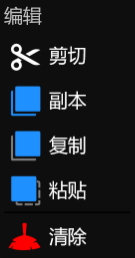
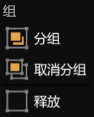
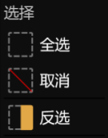
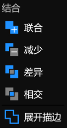

# **编辑菜单**
**编辑菜单提供了编辑、组、选择、结合等功能**
- [**编辑**](#编辑)
- [**组**](#组)
- [**选择**](#选择)
- [**结合**](#结合)

---
 

## **编辑**

|**按钮**|**介绍**|
|:-|:-|
|**剪切**|**删除所选图层，并将其放入剪贴板**|
|**副本**|**插入选定图层的副本**|
|**复制**|**将所选图层复制到剪贴板**|
|**粘贴**|**将剪贴板的图层插入该位置**|
|**清除**|**清除所选图层**|

---
 

## **组**

|**按钮**|**介绍**|
|:-|:-|
|**分组**|**将选定图层放在一个嵌套的组图层里面**|
|**取消分组**|**将组图层的子图层释放出来，并清除组图层**|
|**释放**|**将图层的子图层释放出来**|

---
 

## **选择**

|**按钮**|**介绍**|
|:-|:-|
|**全选**|**选择所有图层**|
|**取消**|**取消选择所有图层**|
|**反选**|**选择所有未选择的图层，取消选择所有选定的图层**|

---
 

## **结合**

|**按钮**|**介绍**|
|:-|:-|
|**联合**|**结果几何包含来自任一源几何的所有区域集合**|
|**减少**|**结果几何仅仅包含所有源几何重叠的区域**|
|**差异**|**结果几何体包含两个源几何中的区域，但重叠的任何零件除外**|
|**相交**|**结果几何体包含第一个源几何体中的任何区域，但不包括属于第二个几何体的任何区域**|
|**展开描边**|**返回等效于此几何体的描边区域的几何体，具有指定的描边宽度和默认描边样式**|

 

> **“展开描边”：选定图层必须有描边，或者描边宽度不为零**