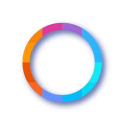
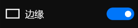

## **图层FX菜单**
**图层FX菜单提供了高斯模糊、锐化、外部投影、浮雕等功能**
- [**高斯模糊**](#高斯模糊)
- [**定向模糊**](#定向模糊)
- [**锐化**](#锐化)
- [**外部投影**](#外部投影)
- [**边缘**](#边缘)
- [**形态学**](#形态学)
- [**浮雕**](#浮雕)
- [**拉直**](#拉直)

---
 

## **高斯模糊**

---
 

## **定向模糊**

---
 

## **锐化**

---
 

## **外部投影**

---
 

## **边缘**

---
 

## **形态学**

---
 

## **浮雕**

---
 

## **拉直**

