# **描边菜单**
**描边菜单用来修改描边样式的破折、描边宽度、端点、拐角、偏移等属性**
- [**破折**](#破折)
- [**描边宽度**](#描边宽度)
- [**端点**](#端点)
- [**拐角**](#拐角)
- [**偏移**](#偏移)
- [**样式跟随变换**](#样式跟随变换)
- [**描边在填充之后**](#描边在填充之后)
- [**描边宽度跟随缩放**](#描边宽度跟随缩放)

---
 

# **破折**
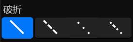

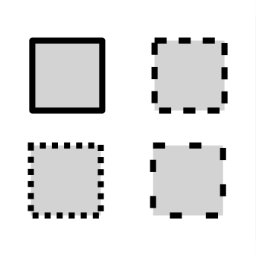

|**按钮**|**介绍**|
|:-|:-|
|**固体**|**——————**|
|**破折**|**— — — — —**|
|**端点**|**· · · · · · · · · · · ·**|
|**破折 端点**|**· — · · — · · —**|

---
 

# **描边宽度**
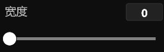
> **描边的宽度**

---
 

# **端点**
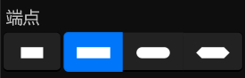

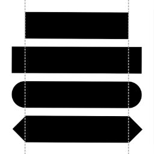

|**按钮**|**介绍**|
|:-|:-|
|**平面**|**无端点**|
|**正方形**|**一个高度等于直线粗细、长度等于直线粗细一半的矩形**|
|**圆形**|**一个直径等于直线粗细的半圆形**|
|**三角形**|**一个底边长度等于直线粗细的等腰直角三角形**|

> **一条线：包含两头的点+中间的破折**

> **如果 "端点" 设置为"平面"，则端点的大小将为零，因此只有破折号可见**

---
 

# **拐角**
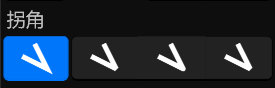

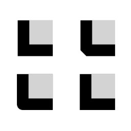

|**按钮**|**介绍**|
|:-|:-|
|**尖角**|**线条联接使用常规角顶点**|
|**斜角**|**线条联接使用斜角顶点**|
|**圆角**|**线条联接使用圆角顶点**|
|**尖角和斜角**|**常规角顶点，除非联接将超出斜接限制；否则，斜面顶点**|

---
 

# **偏移**
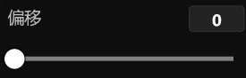
> **描边路径开始的距离**

---
 

## **样式跟随变换**

> **"选中"时：样式的笔刷的控制点位置 跟随 图层的变换**

 

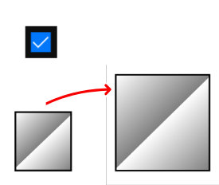

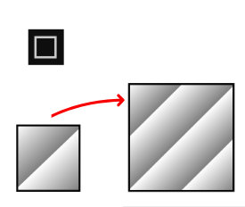

---
 

## **描边在填充之后**
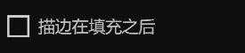
> **"选中"时：样式的描边在填充之后**

 

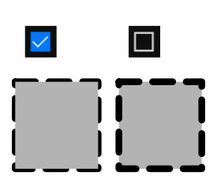

---
 

## **描边宽度跟随缩放**

> **"选中"时：样式的描边宽度 跟随 图层的缩放**

 

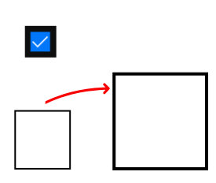

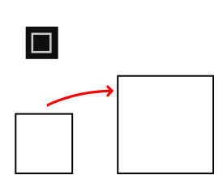