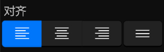
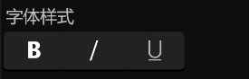
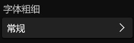
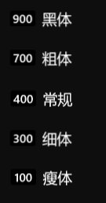
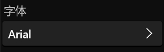
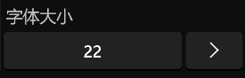

# **字体菜单**
**字体菜单用来修改文本的对齐、字体样式、字体粗细、字体、字体大小等属性**
- [**对齐**](#对齐)
- [**字体样式**](#字体样式)
- [**字体粗细**](#字体粗细)
- [**字体**](#字体)
- [**字体大小**](#字体大小)

---
 

# **对齐**

|**按钮**|**介绍**|
|:-|:-|
|**左对齐**|**The left edge of the text is aligned to the left edge of the layout box**|
|**居中对齐**|**The center of the text is aligned to the center of the layout box**|
|**右对齐**|**The right edge of the text is aligned to the right edge of the layout box**|
|**对齐**|**The left edge of the text is aligned to the left edge of the layout box and broken lines are aligned to the right edge**|

---
 

# **字体样式**

|**按钮**|
|:-|
|**粗体**|
|**斜体**|
|**下划线**|

---
 

# **字体粗细**

|**模式**|**粗细**|
|:-|:-|
|**黑体**|**900**|
|**粗体**|**700**|
|**常规**|**400**|
|**细体**|**300**|
|**瘦体**|**100**|

---
 

# **字体**

> **从你的设备上寻找可用字体**

---
 

# **字体大小**
