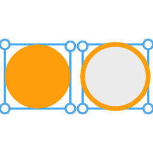
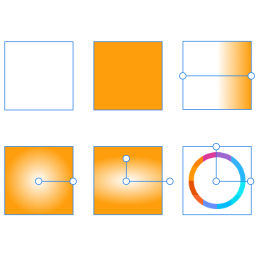
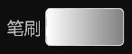
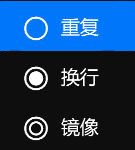
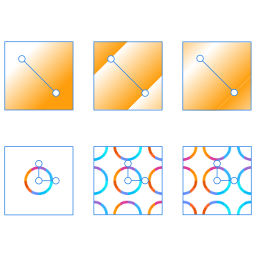


# **笔刷工具**
**笔刷工具用来修改图层的填充、描边等属性**
- [**填充或描边**](#填充或描边)
- [**类型**](#类型)
- [**填充**](#填充)
- [**描边**](#描边)

> **笔刷定义要绘制的东西的颜色。它可以是纯色，也可以是位图图案，也可以是渐变**

---
 

# **填充或描边**

> **一个图层包含 2 个笔刷：填充笔刷与描边笔刷**

|**类型**|**介绍**|
|:-|:-|
|**填充**|**用来填充形状内部区域的笔刷**|
|**描边**|**用来指定形状轮廓绘制方式的笔刷**|

---
 

# **类型**

> **笔刷包含 6 种不同的类型**

|**类型**|**介绍**|
|:-|:-|
|**无**|**没有**|
|**颜色**|**绘制形状为纯色**|
|**线性**|**用于绘制线性渐变的笔刷**|
|**径向**|**用于绘制径向渐变的笔刷**|
|**椭圆形**|**用于绘制椭圆形渐变的笔刷**|
|**图像**|**使用图像内容（如位图）绘制的笔刷**|

> **图像笔刷可用于生成平铺背景，或使用图案填充几何图形**

---
 

# **笔刷**

> **笔刷类型不同，点击时展示的浮出菜单也不同**

|**类型**|**介绍**|
|:-|:-|
|**无**|**没有**|
|**颜色**|**点击选择颜色**|
|**线性**|**点击选择渐变**|
|**径向**|**点击选择渐变**|
|**椭圆形**|**点击选择渐变**|
|**图像**|**点击进入图库页面**|

> **使用图片笔刷时，必须从图库页面选择一张图片**

---
 

# **扩展**

> **指定笔刷在典型区域之外绘制区域的方式**

|**类型**|**介绍**|
|:-|:-|
|**重复**|**重复笔刷内容的边缘像素**|
|**换行**|**平铺笔刷内容**|
|**镜像**|**平铺笔刷内容，然后翻转每个备用磁贴**| 

