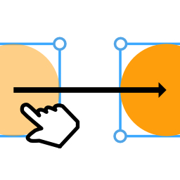
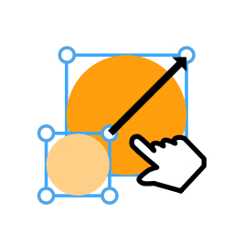
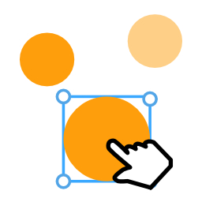

# **光标工具**
**光标工具提供了移动、变换、选择等功能**
- [**移动**](#移动)
- [**变换**](#变换)
- [**选择**](#选择)
- [**更多**](#更多)

---
 

# **移动**

> **移动图层**

---
 

# **变换**

> **调整图层大小**

---
 

# **选择**

> **点击选择图层**

> **框选图层**

 

|**按钮**|**介绍**|**快捷键**|
|:-|:-|:-|
|**新建**|**点击选择一个图层**||
|**增加**|**多选**|**(Shift)**|
|**减少**|**多选**|**(Ctrl)**|

---
 

# **更多**

|**按钮**|**介绍**|**快捷键**|
|:-|:-|:-|
|**等比例缩放**|**缩放图层时按照原有的比例**|**(Shift)**|
|**中心缩放**|**缩放图层时锚点在图层中心**|**(Ctrl)**|