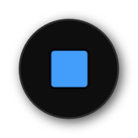
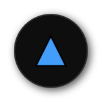


# **矩形工具**
**矩形工具可以用来创建矩形图层**

---

 
  

---

# **椭圆工具**
**椭圆工具可以用来创建椭圆图层**

---

 
  

---

# **圆角矩形工具**
**圆角矩形工具可以用来创建圆角矩形图层**

---

 
  

---

# **三角形工具**
**圆角矩形工具可以用来创建三角形图层**

---

 
  

---

# **钻石工具**
**圆角矩形工具可以用来创建钻石图层**

---

 
  

---

# **五边形工具**
**圆角矩形工具可以用来创建五边形图层**

---

 
  

---

# **星工具**
**圆角矩形工具可以用来创建星图层**

---

 
  

---

# **齿轮工具**
**圆角矩形工具可以用来创建齿轮图层**

---

 
  

---

# **圆环工具**
**圆角矩形工具可以用来创建圆环图层**

---

 
  

---

# **饼工具**
**圆角矩形工具可以用来创建饼图层**

---

 
  

---

# **曲奇工具**
**圆角矩形工具可以用来创建曲奇图层**

---

 
  

---

# **箭头工具**
**圆角矩形工具可以用来创建箭头图层**

---

 
  

---

# **胶囊工具**
**圆角矩形工具可以用来创建胶囊图层**

- [**转换为曲线**](#转换为曲线)
- [**更多**](#更多)
> **在画布上拖拽一段距离来创建图层**

---
  

# **转换为曲线**

> **把几何图层、字体图层、图像图层转换为曲线图层**

---
  

# **更多**

|**按钮**|**介绍**|**快捷键**|
|:-|:-|:-|
|**宽高相等**|**创建的图层的宽与高相等**|**(Shift)**|
|**中心缩放**|**创建的图层的中心点在拖拽起点**|**(Ctrl)**|