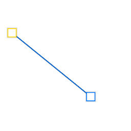
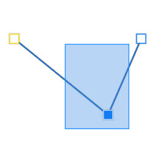
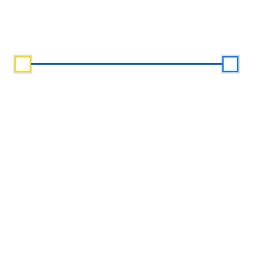
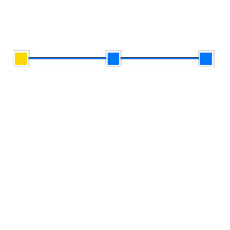
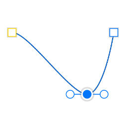
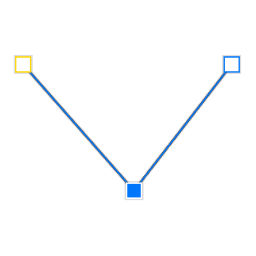
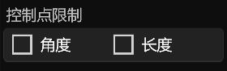

# **钢笔工具**
**钢笔工具可以用来创建曲线图层、并为曲线图层增加节点**
- [**创建曲线**](#创建曲线)
- [**增加节点**](#增加节点)

---
 

# **创建曲线**

> **点击画布并拖拽来创建曲线图层**

---
 

# **增加节点**

> **选中曲线图层，点击画布来增加曲线节点在曲线末端**

---

 
  

---

# **节点工具**
**节点工具可以用来选择、移动、移除、插入、平滑、尖锐曲线的节点**
- [**选择节点**](#选择节点)
- [**移动节点**](#移动节点)
- [**移除节点**](#移除节点)
- [**插入节点**](#插入节点)
- [**平滑节点**](#平滑节点)
- [**尖锐节点**](#尖锐节点)
- [**更多**](#更多)

---
 

# **选择节点**

> **点击选择节点或者框选节点**

---
 

# **移动节点**

> **点击被选中的节点并拖拽来移动节点**

---
 

# **移除节点**

> **移除所有被选中的节点**

---
 

# **插入节点**

> **在两个被选中的节点中间，插入一个新的节点**

---
 

# **平滑节点**

> **平滑所有被选中的节点，并显示左控制点、右控制点**

---
 

# **尖锐节点**

> **尖锐所有被选中的节点，并隐藏左控制点、右控制点**

---
 

# **更多**

|**按钮**|**介绍**|**快捷键**|
|:-|:-|:-|
|**角度**|**移动控制点时，不改变角度**|**(Shift)**|
|**长度**|**移动控制点时，不改变长度**|**(Ctrl)**|

 

|**按钮**|**介绍**|
|:-|:-|:-|
|**对称**|**移动左控制点时，右控制点保持对称**|
|**断开**|**移动左控制点时，右控制点不改变位置**|
|**非对称**|**移动左控制点时，右控制点非对称**|
