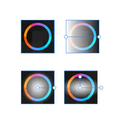

# **透明度工具**
**透明度工具用来修改图层的透明渐变**
- [**类型**](#类型)
- [**笔刷**](#笔刷)

---
 

# **类型**

> **笔刷包含 4 种不同的类型**

|**类型**|**介绍**|
|:-|:-|
|**无**|**没有**|
|**线性**|**用于绘制线性渐变的笔刷**|
|**径向**|**用于绘制径向渐变的笔刷**|
|**椭圆形**|**用于绘制椭圆形渐变的笔刷**|

---
 

# **笔刷**
